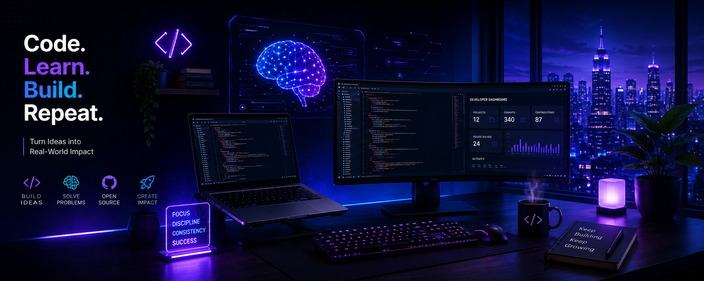

<div align="center">

# 👋 Hey, I'm **Lucky**

### 💻 B.Tech CSE @ GGSIPU  |  Full-Stack Developer  |  AI Builder



<br>

### 🚀 Code. Learn. Build. Repeat.

<p>
  
  
  
  
</p>

<a href="https://github.com/luckypathak78">

</a>

</div>

---

# 👨‍💻 About Me

<table>
<tr>
<td width="50%">

🎓 **B.Tech CSE student at GGSIPU**

🔥 Full-Stack Developer passionate about building impactful web applications

⚛️ Currently improving **React & Backend Development**

🧠 Learning **DSA with C / C++**

🌱 **Open Source Contributor**

💡 Love turning ideas into real-world projects

🚀 Always curious. Always building. Always growing.

</td>

<td width="50%">

### 🛠️ My Development Journey

```text
Ideas
  ↓
Build
  ↓
Break
  ↓
Debug
  ↓
Learn
  ↓
Improve
  ↓
Build Again 🚀
```

> "I don't just want to learn technology.
> I want to build things with it."

</td>
</tr>
</table>

---

# 🛠️ Tech Stack

### 💻 Languages

<p>

</p>

### 🎨 Frontend

<p>

</p>

### ⚙️ Backend

<p>

</p>

### 🗄️ Database

<p>

</p>

### 🧰 Tools

<p>

</p>

---

# 🚀 Featured Projects

<table>
<tr>
<td width="50%">

## 🏥 Doctor Appointment System

A full-stack application for booking doctor appointments, managing slots and handling bookings.

**Tech**

`React` `Node.js` `Express.js`
`MongoDB` `Tailwind CSS`

🔗 **[View Repository →](https://github.com/luckypathak78/Doctor-appointment-Booking-System)**

</td>
</tr>

<tr>
<td width="50%">

## 🛒 Amazon Clone

A responsive Amazon-inspired e-commerce platform with product listings, cart functionality and authentication.

**Tech**

`React` `Node.js` `Express.js` `MongoDB`

🔗 **[View Repository →](https://github.com/luckypathak78/Amazon-clone)**

</td>

<td width="50%">

## 🧒 Kidrove Workshop

A workshop platform where kids can explore, learn and register for events and activities.

**Tech**

`React` `Node.js` `Express.js`
`MongoDB` `Tailwind CSS`

🌐 **[Live Demo →](https://kidrove-workshop-e0r03tn24-lucky20.vercel.app/)**

🔗 **[Repository →](https://github.com/luckypathak78/kidrove-workshop)**

</td>
</tr>
</table>

---

# 🌱 Open Source

<table>
<tr>
<td align="center" width="33%">

### # 🌱 Open Source

<table>
<tr>
<td width="50%">

### 🏯 KanaDojo

**Contributor**

Added the **Umbrella Rain** community theme to KanaDojo.

* 🎯 Issue: [#31323](https://github.com/lingdojo/kana-dojo/issues/31323)
* 🔀 PR: [#31333](https://github.com/lingdojo/kana-dojo/pull/31333)
* ✅ Status: **Merged**

</td>

<td width="50%">

### 🚀 Open Source Journey

I'm actively exploring open-source projects, learning how real-world repositories work, and contributing through issues, pull requests and collaborative development.

**First merged contribution → September 2026 🎉**

</td>
</tr>
</table>


### 💡 What I'm Building

Real-world web applications, AI-powered tools and meaningful projects.

</td>

<td align="center" width="33%">

### 🎯 My Goal

Become a developer who builds products that genuinely solve problems.

</td>
</tr>
</table>

---

# 🧠 Currently Learning

<div align="center">


</div>

---

# 📊 GitHub Stats

<div align="center">


<br><br>


</div>

---

# 📈 Activity

<div align="center">


</div>

---

# 🟩 Contributions

<div align="center">

### 🚀 Building consistently. Learning continuously.


</div>

---

# 📫 Let's Connect

<div align="center">

<a href="https://github.com/luckypathak78">

</a>

<a href="https://www.linkedin.com/">

</a>

</div>

<br>

<div align="center">

### 💜 Thanks for visiting my profile!

**Let's build something amazing together. 🚀**

⭐ If you like my work, consider starring my repositories!

</div>
